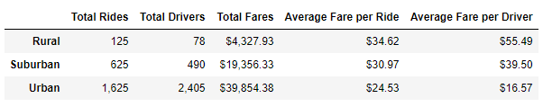
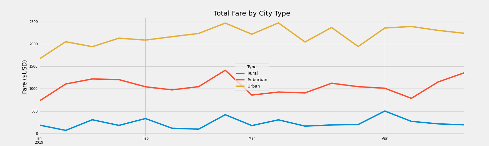

# PyBer Analysis
## Overview of the analysis:
We had to analyze all the rideshare data from January to early May of 2019 and create a compelling visualization for the CEO  of Pyber, a ride-sharing app company valued at $2.3 billion. In this analysis we look at how the number of drivers and riders varies within rural, suburban, and urban city types. In addition, we review the percentage of total fares, drivers, and riders that occurred in each city type in 2019.
## Results:
Based on our analysis
- ### Results for Rural areas:
    - Total Rides: 125
    - Total Drivers: 78 
    - Total Fares: $4,327.93
    - Average Fare per Ride: $34.62
    - Average fare per Driver: $55.49
- ### Results for Suburban areas:
    - Total Rides: 625
    - Total Drivers: 490 
    - Total Fares: $19,356.33
    - Average Fare per Ride: $30.97
    - Average fare per Driver: $39.50
- ### Results for Rural areas:
    - Total Rides: 1625
    - Total Drivers: 2405 
    - Total Fares: $39,854.38
    - Average Fare per Ride: $24.53
    - Average fare per Driver: $16.57

## Summary:
 Based on our analysis, Urban areas have the highest number of drivers, sitting at 2,405 and serving a total of 1,625 riders yearly. Although it has the highest profit of $39,854.38, low average fare per ride of $24.53 and $16.57 average fare per driver indicate a couple of issues which should be addressed by PyBer. The company needs to shift its focus on increasing the rider demand, in order to sustain the high number of drivers available, avoid a high turnover rate and continue to raise the profits in Urban neighborhoods. In the Suburban areas, the correlation between drivers and riders is yielding  higher average fare rides with total fares of $19,356.33. For 490 drivers serving 625 rides, it produces an average $39.50 fare per driver and an average $30.97 fare per ride. These numbers are still indicating areas for improvement, considering that the rider demand can be increased. However, the Suburban areas don’t produce enough demand to outweigh the potential profits in the Urban neighbourhoods. The results produced by the Rural areas were the most volatile. Rural areas are determined to be the least profitable with a total value of fares in 2019 only at $4,327. Considering the low population and demand in these areas, the least amount of resources should be directed on developing the business in Rural neighbourhoods. 
 
 The graph below indicates that the Urban areas are more profitable from January 2019 to April 2019 than Rural and Suburban areas. 

